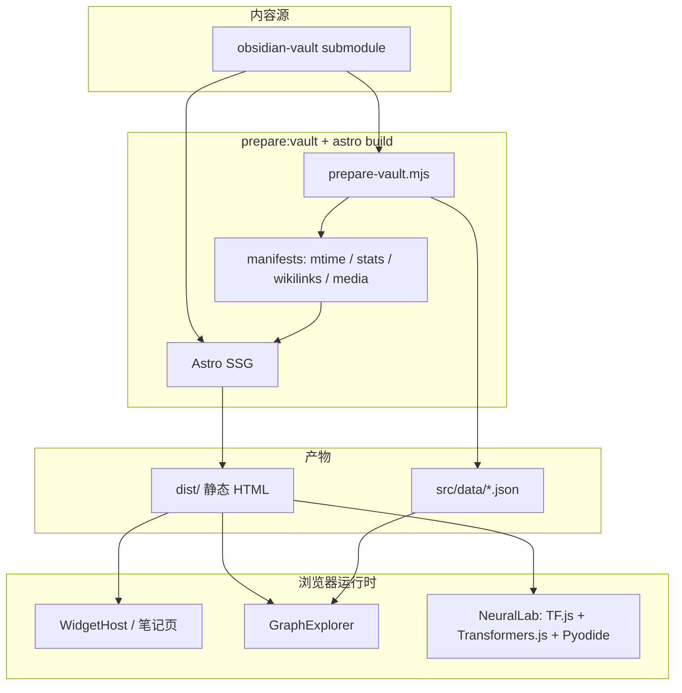

# My Second Brain

个人知识库静态站点：将 Obsidian vault 发布为可浏览、可搜索、带桌面小组件与多种数学/ML 交互工具的 Web 应用。

**在线站点：** [my-second-brain1.pages.dev](https://my-second-brain1.pages.dev)

---

## 技术栈

| 类别 | 技术 | 说明 |
|------|------|------|
| 框架 | **Astro 6** | SSG、内容集合、MDX |
| UI | **Svelte 5** | 交互组件（桌面、工具、可视化） |
| 样式 | **Tailwind CSS v4** | `@tailwindcss/vite` |
| 笔记 | **remark/rehype** | WikiLink、Callout、KaTeX、Mermaid |
| ML / 数值 | **TensorFlow.js**、**Transformers.js**、**Pyodide + SymPy** | 手写数字、公式 OCR、符号求解 |
| 3D | **Three.js** | CNN 网络 3D 可视化 |
| 包管理 | **pnpm 11** | Node **≥ 22.12**（`.nvmrc` → 22.22.0） |

---

## 仓库结构

```
my-second-brain/
├── astro.config.mjs          # Astro / Vite / Markdown 插件链、分包策略
├── package.json
├── pnpm-workspace.yaml
├── obsidian-vault/           # git submodule — 所有 .md 笔记源
│
├── public/                   # 静态资源（构建时部分由脚本生成）
│   ├── _headers              # Cloudflare 缓存头
│   ├── models/mnist/         # TF.js LeNet 权重（pnpm model:export-mnist）
│   ├── music/ picture/ video/ voice/
│   └── vault-assets/         # prepare:vault 从 vault 同步（.gitignore）
│
├── scripts/                  # 构建与维护脚本（见「脚本命令」）
├── docs/
│   ├── VAULT_SYNC.md         # Vault 双向同步说明
│   └── WIKILINKS_REPORT.md   # 双链扫描报告（构建生成）
│
└── src/
    ├── content.config.ts     # notes 集合：glob obsidian-vault/**/*.md
    ├── env.d.ts
    │
    ├── data/                 # prepare:vault / build 生成的 JSON
    │   ├── stats.json        # 笔记统计、热力图
    │   ├── wikilinks.json    # 图谱节点/边
    │   └── media-manifest.json
    │
    ├── layouts/
    │   ├── BaseLayout.astro      # 标准内容页
    │   ├── DesktopLayout.astro   # 首页桌面 + 开屏
    │   └── ToolLayout.astro      # 工具页（可选 MathJax）
    │
    ├── pages/                  # 路由 → 功能
    │   ├── index.astro           # 桌面首页（WidgetHost + HomeHero）
    │   ├── notes/[...slug].astro # 单篇笔记
    │   ├── notes/index.astro     # 笔记目录
    │   ├── folder/[...folder].astro
    │   ├── tags/                 # 标签索引与筛选
    │   ├── graph.astro           # 关系图谱
    │   ├── python.astro          # Python IDE（Pyodide）
    │   ├── matlab.astro          # 矩阵 / 微积分 / 离散 / 统计
    │   ├── digits.astro          # 神经网络实验室
    │   ├── formula.astro         # → 重定向 /digits?demo=formula
    │   ├── whiteboard.astro      # Excalidraw 白板
    │   └── data/notes.json.ts    # 搜索 API
    │
    ├── components/             # 通用 Svelte / Astro 组件
    │   ├── widgets/            # 桌面小组件（时钟、音乐、图谱等）
    │   ├── graph/              # GraphExplorer 多视图
    │   ├── matrix/             # 矩阵实验室
    │   ├── calculus/           # 微积分步进
    │   ├── statistics/         # 统计实验室
    │   ├── python/             # Python 编辑器
    │   ├── HomeHero.svelte
    │   ├── PythonIDE.svelte
    │   ├── MatlabCalculator.svelte
    │   └── ExcalidrawBoard.svelte
    │
    ├── lib/
    │   ├── site-nav.ts         # 全站导航定义
    │   ├── neural-lab-meta.ts  # 神经网络实验室文案
    │   │
    │   ├── components/
    │   │   ├── NeuralLab/          # 实验室壳（Tab：手写数字 | 数学公式）
    │   │   └── DigitRecognizer/    # MNIST CNN + 2D/3D 可视化
    │   │       ├── canvas/         # 280×280 画板
    │   │       ├── model/          # 加载、预处理、双路推理
    │   │       └── visualization/  # 网络图、特征图、PredictionBars
    │   │
    │   ├── formula-recognizer/     # FormulaNet OCR + SymPy 求解
    │   │   ├── formula-ocr.worker.ts
    │   │   ├── formula-solver.py   # Pyodide 加载
    │   │   ├── CanvasFormulaRecognizer.svelte
    │   │   └── FormulaSolverPanel.svelte
    │   │
    │   ├── matrix/ calculus/ discrete/ statistics/  # MATLAB 页引擎
    │   ├── remark-*.mjs / rehype-*.mjs              # Markdown 扩展
    │   └── notes-mtime.json        # prepare:vault 生成
    │
    └── styles/
        ├── globals.css
        └── global.css
```

---

## 功能与运行逻辑

### 1. 构建流水线

每次 `pnpm dev` / `pnpm build` 先执行 **`pnpm prepare:vault`**：

```
prepare-vault.mjs
  ├─ 校验 obsidian-vault submodule
  ├─ CI 浅克隆时 git fetch --unshallow（笔记更新时间）
  ├─ sync-assets.mjs        → public/vault-assets/
  ├─ build-mtime-manifest.mjs → src/lib/notes-mtime.json
  ├─ build-media-manifest.mjs → src/data/media-manifest.json
  ├─ build-stats.mjs        → src/data/stats.json
  └─ build-wikilinks.mjs      → src/data/wikilinks.json + docs/WIKILINKS_REPORT.md
```

Astro 读取 `obsidian-vault` 生成静态 HTML；Svelte 岛屿在客户端 hydration。

### 2. 笔记系统

| 能力 | 实现 |
|------|------|
| Wiki 双链 `[[…]]` | `remark-wiki-link`（蓝链 / 红链未创建） |
| 嵌入 `![[…]]` | `remark-obsidian-image.mjs` |
| Callout | `remark-obsidian-callout` |
| 数学公式 | `remark-normalize-math` + `rehype-katex` |
| Mermaid | `remark-mermaid.mjs` 懒渲染 |
| 反向链接 | `Backlinks.astro` |
| 目录 TOC | 可折叠 / 可拖动 |
| 最后更新 | `notes-mtime.json` + git log |

### 3. 桌面首页 (`/`)

- **DesktopLayout**：Mac 风格菜单栏、开屏动画
- **WidgetHost**：可拖拽小组件（音乐、天气、时钟、笔记、图谱等）
- **HomeHero**：统计概览、快捷入口

### 4. 关系图谱 (`/graph`)

- **GraphExplorer**：力导向 / 径向 / 聚类 / 弧线图 / 领地地图
- 数据源：`src/data/wikilinks.json`

### 5. Python IDE (`/python`)

- **Pyodide** 浏览器内运行 Python
- 代码高亮、逐步执行说明

### 6. MATLAB 计算器 (`/matlab`)

**MatlabCalculator** 五个 Tab：

| Tab | 模块 | 路径 |
|-----|------|------|
| 矩阵 | 行化简、秩、解方程 | `src/lib/matrix/` |
| 微积分 | 符号步进 | `src/lib/calculus/` |
| 离散 | 逻辑表达式 | `src/lib/discrete/` |
| 统计 | 概率、假设检验 | `src/lib/statistics/` |
| 表达式 | mathjs 求值 | 组件内 |

### 7. 神经网络实验室 (`/digits`)

**NeuralLab** 两个演示 Tab（URL：`?demo=formula` 切换公式）：

#### 手写数字 · MNIST

```
DrawingCanvas (280×280)
  → mnist-preprocess（单路 / 双路）
  → TF.js LeNet (/models/mnist/model.json)
  → runInference → NetworkPanel（diagram / 2D / 3D）+ PredictionBars
```

- **高精度（双路推理）**：`直接缩放` vs `居中裁剪+加粗`，按置信度选优
- **可视化**：SVG 结构图、卷积特征图、Three.js 3D、层间数据流动画

#### 数学公式 · FormulaNet + SymPy

```
CanvasFormulaRecognizer (384×384)
  → formula-ocr.worker（Transformers.js / FormulaNet）
  → LaTeX 预览（MathJax）
  → FormulaSolverPanel（Pyodide + formula-solver.py）
```

- OCR 模型**运行时**从 Hugging Face 下载（不入 git）
- 支持：化简、方程、微积分、正态分布 Φ(x) 等

### 8. 白板 (`/whiteboard`)

- **Excalidraw** 嵌入，手绘风格

---

## 路由一览

| 路径 | 页面 | 主要组件 |
|------|------|----------|
| `/` | 桌面首页 | WidgetHost, HomeHero |
| `/notes`, `/notes/*` | 笔记 | NoteDetailLayout, Toc |
| `/folder/*` | 文件夹浏览 | FolderTree |
| `/tags`, `/tags/*` | 标签 | — |
| `/graph` | 关系图谱 | GraphExplorer |
| `/python` | Python IDE | PythonIDE |
| `/matlab` | 数学工具 | MatlabCalculator |
| `/digits` | 神经网络实验室 | NeuralLab |
| `/digits?demo=formula` | 公式识别 Tab | CanvasFormulaRecognizer |
| `/formula` | 重定向 | → `/digits?demo=formula` |
| `/whiteboard` | 白板 | ExcalidrawBoard |
| `/data/notes.json` | 搜索数据 | API route |

导航定义：`src/lib/site-nav.ts`

---

## 本地开发

```bash
# 首次克隆（含 submodule）
git clone --recursive https://github.com/Takalahiro/my-second-brain1.git
cd my-second-brain1

pnpm install
pnpm dev          # http://localhost:4321
```

```bash
pnpm build        # 生产构建 → dist/
pnpm preview      # 预览 dist/
```

### 自检

```bash
pnpm build
node scripts/check-25mib.mjs    # git 跟踪文件 ≤ 25 MiB
node scripts/self-check.mjs http://localhost:4321   # preview 启动后
```

---

## 脚本命令

| 命令 | 作用 |
|------|------|
| `pnpm dev` | prepare:vault + 开发服务器 |
| `pnpm build` | prepare:vault + 静态构建 |
| `pnpm prepare:vault` | Vault 预处理（见上文流水线） |
| `pnpm vault:sync "msg"` | commit + push vault + 更新 submodule 指针 |
| `pnpm vault:pull` | 拉取 vault 远程 |
| `pnpm vault:audit` | 检查 vault 目录结构 |
| `pnpm vault:diagnose` | 扫描笔记常见问题 |
| `pnpm model:export-mnist` | Python 训练 3 epoch + 导出 TF.js 到 `public/models/mnist/` |

其他维护脚本见 `scripts/`：`full-sweep.mjs`、`verify-katex.mjs`、`find-broken-wikilinks.mjs` 等。

---

## 模型与体积限制

| 模型 | 位置 | 说明 |
|------|------|------|
| MNIST LeNet | `public/models/mnist/` | git 跟踪，~879 KB 参数 |
| FormulaNet | Hugging Face CDN | 运行时下载，encoder ~52 MiB + decoder ~25 MiB |
| SymPy | Pyodide CDN | 首次求解时加载 ~10–20 MB |

`scripts/check-25mib.mjs` 确保**入库文件**单文件 ≤ 25 MiB（Cloudflare Pages 限制）。大模型走浏览器缓存，不提交进 git。

---

## Cloudflare Pages 部署

| 设置 | 值 |
|------|-----|
| Build command | `pnpm build` |
| Output directory | `dist` |
| Node | 22.x（`.nvmrc`） |
| Package manager | pnpm（`packageManager` 字段） |
| **Include git submodules** | **必须开启** |

构建第一步 `prepare:vault` 会初始化 submodule、同步资源、生成 manifest。详见 [docs/VAULT_SYNC.md](docs/VAULT_SYNC.md)。

---

## Vault 同步（简要）

- 本地：`pnpm vault:sync "说明"` — 一键 push vault 并更新父仓库 submodule
- CI：`.github/workflows/sync-vault-submodule.yml` 定期 poll vault 上游

---

## 数据流总览



---

## 贡献与联系

- 作者：Takahiro
- 仓库：[Takalahiro/my-second-brain1](https://github.com/Takalahiro/my-second-brain1)

欢迎 Issue / PR。笔记内容在独立 vault 仓库，通过 submodule 关联。
